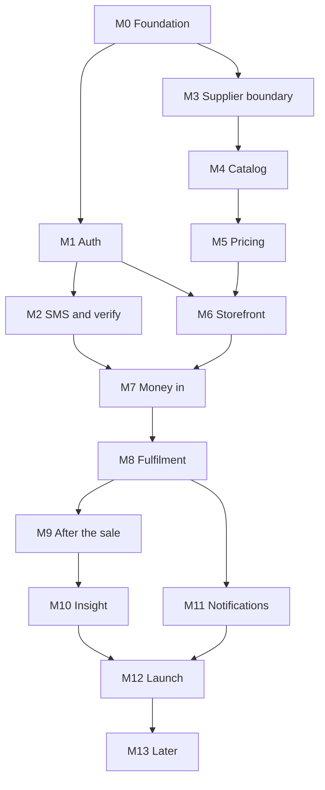
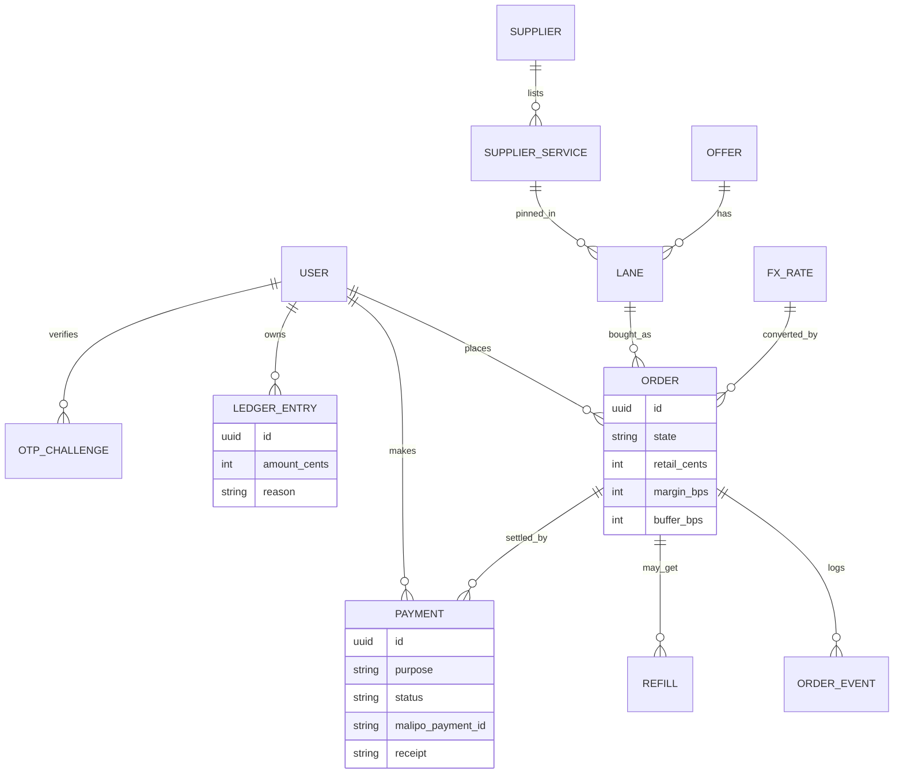

# ViewNinjas — build plan

`scope.md` §15 gives the phases. This is the sequence: what to build, in what order, and how you know it is finished. Every milestone is independently shippable and demoable. Nothing is a big-bang launch.

The order is deliberate. Milestones 0–6 build breadth — the account, the catalog, the price — so that when money arrives in milestone 7 it is not sitting on a fictional shop. Milestones 7–9 are the vertical slice that actually earns: take a shilling, place an order, promise the customer something true. Milestone 10+ is leverage.

The three surfaces in `scope.md` §11 land in that order too: the market page and the dashboard shell in M6, the dashboard's stats filling in across M7–M9 as the wallet, orders, refunds, and refills arrive, and the super-admin back office in M9–M12.

Two ideas run through the whole plan:

- **A tracer bullet, not scaffolding.** Milestone 0 puts an empty app on a real phone on day one. Every later milestone fills a working spine rather than building a layer nobody can see yet.
- **Risk spikes run in parallel.** The scary unknowns (does Malipo settle? does a supplier `add` behave? does the PWA install on a Tecno?) are retired by throwaway spikes alongside the early milestones, not discovered at launch. See the end.

---

## How to read a milestone

Each one has the same shape:

- **Goal** — the single sentence it exists to make true.
- **Ships** — the concrete pieces.
- **Exit criteria** — the demo that proves it. If you cannot demo it, it is not done.
- **Depends on** — what must already exist.
- **Not yet** — what is deliberately deferred, so scope does not creep in.

### The definition of done, applied to every milestone

- Runs in staging and is demoable on a real Android phone, not just in tests.
- Tests around the money and identity paths (unit + one integration).
- No secrets in the repo. Config only.
- Behind a flag or a role until the milestone after it lands.
- An entry in the one-page runbook if it can fail in production.

### Map to the phases in `scope.md` §15

| Phase | Milestones |
| --- | --- |
| Phase 0 — skeleton | M0 Foundation, M1 Auth, M2 SMS |
| Phase 1 — menu | M3 Supplier boundary, M4 Catalog, M5 Pricing, M6 Market and shell |
| Phase 2 — money, then fulfilment | M7 Money in, M8 Fulfilment |
| Phase 3 — promises on the tin | M9 After the sale, M10 Insight, M11 Notifications, M12 Launch |
| Phase 4 — only if phase 2 is earning | M13 Later |

---

## Dependency map

Money (M7) waits on a verified phone (M2) and a real price (M5, M6). That is the whole point of the ordering.

---

## M0 — Foundation

**Size:** M · **Depends on:** nothing

**Goal.** A deployed app shell that loads on a phone and does nothing else, correctly.

**Ships**

- Phoenix 1.8 + LiveView, Ecto/Postgres, Oban, Finch, per-env config.
- CI: `mix format`, `credo`, `mix test`; a staging deploy (Fly.io or one VPS) with managed Postgres.
- `/health` endpoint. Structured logs. Error reporting (Sentry or AppSignal).
- The shell: one-column layout, bottom tab bar with placeholder tabs (Shop, Orders, Wallet, Account), safe-area CSS, `dvh`, web manifest + maskable icons, a service worker with an offline splash, and a first-run add-to-home-screen prompt — the installable PWA from `scope.md` §12.

**Exit criteria.** Staging URL opens on a real phone, installs to the home screen and launches without a URL bar, CI goes green on a trivial PR.

**Not yet.** Auth, catalog, money.

---

## M1 — Authentication and identity

**Size:** M · **Depends on:** M0

**Goal.** A person can create an account with email and phone, sign in, and hold a role.

**Ships**

- `phx.gen.auth` → email + password. Add a **required phone** field and a `role` enum (`customer` | `admin` | `super_admin`, `scope.md` §6).
- **One phone normalizer**, shared forever: `254712345678`, `0712345678`, `+254712345678`, `712345678` collapse to one canonical `2547…`. This module is reused verbatim by SMS (M2) and Malipo (M7) — write it once, test it hard.
- Password reset by email; transactional email configured and deliverability-checked.
- Role enforcement in the router and in the LiveViews. Admin accounts are created by a `mix` task, never by public signup.
- Rate-limit signup and login per IP and per phone (`scope.md` §13).

**Exit criteria.** Sign up, log in, reset a password, and get bounced from admin as a customer; a script cannot mass-create accounts.

**Not yet.** SMS OTP — the phone is captured but marked unverified here.

---

## M2 — SMS and phone verification

**Size:** M · **Depends on:** M1

**Goal.** The phone on the account is proven to be the person's, and proving it cannot be abused.

**Ships**

- SMS provider: **Africa's Talking** (Kenyan, local routes, KES billing, registered sender ID, delivery-report callback). Alternatives — Twilio, Infobip, Advanta — cost more to Kenya or are slower to provision; revisit only if delivery drops.
- OTP: 6 digits, 5-minute expiry, at most 3 attempts, 60-second resend throttle, per-number **and** per-IP caps, single use.
- Verify screen with `autocomplete="one-time-code"`, a resend countdown, and a lockout that is visible, not silent.
- A daily SMS spend cap with an alert. **SMS pumping is a top-three fraud risk in Kenya** — a script that requests OTPs at premium ranges can bill you by the thousand. Cap by number, by IP, and by day, and alert on anomalies.

**Exit criteria.** A real Kenyan number receives and verifies an OTP; a brute-force loop is stopped and logged; a spend-cap alert fires in staging.

**Creative aside.** M-Pesa gives you a free verification signal: the first successful STK push to a number proves control of that MSISDN, because the PIN is entered on that phone (`scope.md` §6). Keep SMS OTP for signup — a stranger must not be able to create an account by triggering a prompt — but for later low-friction flows (a repeat wallet top-up, a re-login) the payment itself can stand in for the OTP. And when WhatsApp Business API is worth the setup, OTP and order updates over WhatsApp beat SMS on both deliverability and cost in this market. Park both in M13.

**Not yet.** Transactional order notifications (that is M11).

---

## M3 — Supplier boundary

**Size:** L · **Depends on:** M0

**Goal.** Three keys in, one client out. We can see the wholesale catalog and our float.

**Ships**

- Supplier keys encrypted at rest (`cloak_ecto`, `scope.md` §12), one config row per panel: `secsers`, `jap`, `smmfollows`.
- `Suppliers.Panel` behaviour and a single `Suppliers.V2` client over Finch (`scope.md` §5).
- `balance` probe with a manual admin trigger that proves all three keys work.
- `services` sync as an Oban job: upsert by `(supplier, external_id)`, record rate/min/max/refill/cancel, mark anything missing from a pull inactive. Ingestion is **wholesale** — every service the panel sells lands here, unfiltered; nothing is judged on the way in (`scope.md` §9).

**Exit criteria.** Admin clicks sync and sees the raw catalog and a balance for all three panels; a wrong key surfaces as one clear error, not a stack trace.

**Not yet.** Curated offers — this is the raw feed.

---

## M4 — Catalog and curation

**Size:** L · **Depends on:** M3

**Goal.** An admin can see every service from every panel and decide which ones buyers see.

**Ships**

- `Offer` and `Lane` models (`scope.md` §6). A lane is an offer + grade + pinned `SupplierService`, unique on `(offer, grade)`.
- The catalog workspace over the full synced inventory: search and filter by panel, category, refill, bounds, and computed KES cost (`scope.md` §9).
- Triage: shortlist a row (`shortlisted_at`) as you read. Changes nothing a buyer sees.
- Placement: pin a service as Cheap / Moderate / Quality on an offer, price it, publish it. The three tiers — ingested, shortlisted, published — are the whole selection model.
- A suggestion strip — cheapest refillable, cheapest of any kind, name match. Suggestions are never auto-published.
- Stale flag when a pinned row changed price, bounds, or active.
- Capability flags from the supplier row drive whether Cancel and Refill are even shown.

**Exit criteria.** A person builds "Instagram followers" with three honest lanes from the synced inventory in one sitting, shortlists a fourth candidate, and unpublishes a lane — all without a re-sync.

**Not yet.** The customer never sees this; it is admin-only.

---

## M5 — Pricing engine and settings

**Size:** M · **Depends on:** M4

**Goal.** A deterministic, auditable KES quote from a lane, driven by settings a super-admin owns.

**Ships**

- `PricingSettings` singleton as append-only versions — `margin_bps` (default **13,000 / 130%**), `buffer_bps` (default **300 / 3%**), FX override, rounding, actor, reason (`scope.md` §6, §7). The pricer reads the current version; nothing is edited in place.
- The integer quote engine in ppm/bps (`scope.md` §7) with unit tests on rounding and on the boundaries (min/max quantity, zero, huge).
- `FxRate`: a fixture first, then a daily source job that records its source. Super-admin manual override for a bad day.
- The guardrail: refuse to publish a lane whose price sits at or under landed-plus-buffer.

**Exit criteria.** Golden tests reproduce the §7 worked example exactly (`0.90` USD/1,000, FX `129.40`, 1,000 units → **KSh 276**); a super-admin raises the margin and the catalog re-quotes; an order already paid does not move.

**Not yet.** Rendering the price to a customer — that is M6.

---

## M6 — The market and the app shell

**Size:** L · **Depends on:** M1, M5

**Goal.** Anyone can open the homepage, browse real prices, and sign up. No payment yet.

**Ships**

- **The market page:** what it is, the three grades in plain language, platform chips, and offers with real from-prices (`scope.md` §11). Browsing is public; buying needs an account. No invented prices — an offer without a published lane is not shown.
- Offer page: three grade cards with min/max and refill, a link field, a quantity, and a live total in whole shillings.
- Link handling: untrusted input, length limit, `https` allow-list, no server-side fetch (`scope.md` §13).
- **The shell, for real:** the four tabs (Home, Shop, Orders, Account), View Transitions push/pop, skeleton states instead of spinners, a connection banner, and the mobile-first rules from `scope.md` §12.
- **The buyer dashboard, stubbed:** Home shows the wallet card and the orders list, both empty here. Their stats strip fills in as M7 (wallet), M8 (orders) and M9 (refunds, refills) land.
- **First-party page views, collect-only:** write `PageView` rows (home, offer, checkout started) with a daily-rotating `visitor_hash` from day one. No third party, no screens yet — the traffic panel is M10. Collecting here is what gives M10's charts history instead of starting from empty.

**Exit criteria.** Install the PWA on an Android phone from the market page, browse to a total signed out, sign up, and hit the first-paint budget on 3G.

**Not yet.** No `add`. No money. The total is a promise, not a charge.

---

## M7 — Money in

**Size:** L · **Depends on:** M2, M6

**Goal.** Take a real shilling on a customer's phone, safely, and be able to prove it.

**Ships**

- The ledger: append-only entries; wallet balance is the sum, never a column (`scope.md` §6).
- The Malipo client, the `Payment` model, and idempotency keys per checkout attempt (`scope.md` §8, `malipo-connect.md`).
- Create → prompt → poll or callback. The `ConfirmPayment` worker (`unique` on payment id, snooze until the deadline) and the `SweepPendingPayments` cron (`malipo-connect.md` §9).
- **One rule, enforced everywhere:** a payment is paid only when `GET /v1/payments/{id}` returns `settled`. The callback is a hint.
- Callback controller: optional signature check, dedupe on payment id and event id, answer `2xx` fast, work in Oban.
- Two flows: pay-this-order (hold then capture) and wallet top-up (`scope.md` §8).
- The full-screen M-Pesa payment sheet (`scope.md` §12) and a failure UX that maps `failure_kind` to customer copy; a retry is a new idempotency key.

**Exit criteria.** In sandbox, then against a **live destination confirmed in Connect**: a real payment settles, the ledger is correct, the receipt is stored, a duplicate callback does not double-credit, and a cancelled prompt leaves the order retryable.

**Invariants this milestone must leave behind.** Every later money feature inherits these; a milestone that breaks one is not done:

1. Money moves only on `settled`, confirmed by a `GET`.
2. The ledger is append-only; balances are derived.
3. Retrying is safe — same idempotency key returns the original payment.
4. Paid orders snapshot the margin, buffer, and FX they were priced with.

---

## M8 — Fulfilment

**Size:** L · **Depends on:** M7

**Goal.** A paid order becomes a supplier order exactly once, and the customer watches it move without refreshing.

**Ships**

- Placement job with the no-retry rule (`scope.md` §5): persist intent as `placing`, send `add` once, short timeout, no automatic retry.
- On success → `placed`. On a definite error → `failed` and refund the wallet. On timeout or a garbled body → `needs_review`. **Never call `add` twice.**
- Status batch job every minute: group non-terminal orders by supplier, chunk by 100, map supplier status to our states, and write `charge`, `remains`, `start_count` back onto the order so margin is real (`scope.md` §10).
- Order page over PubSub, with the timeline built from `OrderEvent`.

**Exit criteria.** Pay → placed → in_progress → completed, all visible live on the phone. A simulated ambiguous `add` lands in `needs_review` and does **not** produce a second order.

---

## M9 — After the sale

**Size:** L · **Depends on:** M8

**Goal.** The promises on the tin: partials, refills, and a supplier float that never fails a paid customer.

**Ships**

- Partial completion → automatic wallet credit from `remains` using the KES-per-unit captured on the order; support can override, default is to credit (`scope.md` §6).
- Refill: a button on an eligible completed order, one supplier call, `refill_status` until resolved; Rejected stays rejected and does not auto-open a second refill.
- Supplier float: balance job pauses lanes on a low supplier **before** payment, not after (`scope.md` §10).
- Stale-lane unpublish and admin alerts.
- Admin review queue: filter `needs_review` and `partial`.
- **A first admin overview** — the paid → placed → completed funnel, payment settled/failed, and the money at risk. Profit, progress, and traffic are M10's job.
- Margin report: retail KES against actual USD charge, per order, lane, and week — the per-order detail behind M10's headline.

**Exit criteria.** A partial refunds the unfinished shillings to the wallet without support touching it; a paused lane shows "this grade is paused" before the customer pays.

---

## M10 — Insight

**Size:** M · **Depends on:** M9

**Goal.** The super-admin can see profit, progress, and who is visiting — without a third-party analytics script.

**Ships**

- **Profit.** The P&L from `scope.md` §10: revenue (settled, wallet-funded orders counted once), cost of goods at each order's snapshot FX, gross margin, Malipo fees, SMS, fixed costs, and net — for today, week, and month, with a trend and a break-even line. `payments.fee_cents` is reconciled from the settlement, never assumed.
- **Settlement reconciliation.** Import a Malipo statement into `settlement_lines`, match on the Malipo id or the M-Pesa receipt inside the statement's window, fill `fee_cents` and `settled_on`, and surface the four buckets — matched, amount mismatch, provider-only, local-only — with the payout delta (`malipo-connect.md` §10). Flags for a person, never an automatic ledger write.
- **Progress.** `Target` rows for revenue, orders, new customers, and margin, against actual with the delta and days left; the settled-order streak; the 30-day repeat rate.
- **Traffic, first-party.** The `PageView` rows have been accruing since M6 — this milestone adds the screens over them, and a tiny beacon for the Astro pages later. A daily-rotating `visitor_hash`, no cookies, no third party. The funnel home → offer → checkout → settled → order, sources from referrer and `utm_*`, and the viewed-against-bought gap per offer.
- **A daily rollup** (`analytics_daily`) so the charts are cheap on the phone and rebuildable from the raw rows.
- **A weekly digest** to the super-admin and **anomaly alerts**: settled-rate drop, a `failure_kind` spike, OTP delivery slip, a negative-margin lane, a traffic cliff.
- Admin actions timestamped onto the charts, so a move in revenue has a visible cause.

**Exit criteria.** The super-admin opens one screen and reads this month's profit, whether the target is on track, where visitors came from, and where the funnel leaks — and gets the same as a Sunday message. A statement with one injected anomaly lands in the right bucket, and a clean day reconciles to a zero payout delta.

**Not yet.** Nothing customer-facing. This only reads what the earlier milestones already produce.

---

## M11 — Notifications and receipts

**Size:** S–M · **Depends on:** M8

**Goal.** The customer is not left refreshing, and every order leaves a receipt.

**Ships**

- Transactional SMS (Africa's Talking) on `paid`, `completed`, and `refunded`, with opt-out honored and quiet hours.
- Email receipt carrying the M-Pesa receipt code.
- Consider Web Push for the PWA — note iOS limits; defer if the effort is not repaid.

**Exit criteria.** A completed order texts the customer the receipt; daily SMS volume is on the dashboard and alerts on a spike.

**Creative aside.** Order updates over WhatsApp Business beat SMS on cost and deliverability here. M11 is the natural place to prove the integration; folding OTP onto it is an M13 job.

---

## M12 — Hardening and launch readiness

**Size:** M · **Depends on:** M10, M11

**Goal.** Meet the "done" bar in `scope.md` §17 on production, with real money.

**Ships**

- Security pass on the money and identity paths: SSRF on links, role checks, secret hygiene, rate limits, and a look at the callback handler.
- Observability: payments settled/failed rate, OTP delivery rate, supplier error rate, Oban queue lag — with alerts, not just graphs.
- Backups and PITR, plus runbooks: stuck payment, supplier outage, float paused, Malipo key rotated, settlement mismatch.
- The consumer-facing items: refund-policy copy, the ToS risk carried in the open (`scope.md` §13), brand and destination confirmed (`scope.md` §16).
- Rehearse key rotation. Confirm the live destination once more in Connect.

**Exit criteria.** `scope.md` §17, end to end, on production, with a real customer and a real shilling.

---

## M13 — Later, only if phase 2 is earning

**Size:** varies · **Depends on:** M12

Drip (`runs`, `interval`). Non-default service types, each as its own form. Astro marketing pages fed by a read-only offers endpoint. Swahili copy. Card top-up. A customer API (other Kenyans reselling ViewNinjas) as a thin authenticated wrapper over the same order context — never a pass-through of supplier keys. WhatsApp for OTP and notifications. A Capacitor/WebView shell or React Native only if app-store presence or push notifications become the real bottleneck (`scope.md` §16).

---

## Schema by milestone

A table lands in the milestone that first needs it, in a migration named for that milestone. Migrations are additive: add a column, backfill, and never fold a destructive rename into the same step. The money tables are append-only — `ledger_entries`, `pricing_settings`, and `fx_rates` are never `UPDATE`d, only appended to (a correction is a new row).

| Milestone | Tables first created | Also |
| --- | --- | --- |
| M1 | `users`, `users_tokens` | — |
| M2 | `otp_challenges`, `sms_messages` | `users.phone_verified_at` |
| M3 | `suppliers`, `supplier_services` | `supplier_services.shortlisted_at` |
| M4 | `offers`, `lanes` | — |
| M5 | `pricing_settings`, `fx_rates` | — |
| M6 | `page_views` | collect-only, no screen |
| M7 | `orders`, `order_events`, `payments`, `ledger_entries` | — |
| M8 | *(none — uses the supplier columns on `orders`)* | indexes on `orders` |
| M9 | `refills` | `suppliers.paused_at` |
| M10 | `analytics_daily`, `costs`, `targets`, `settlement_lines` | `payments.fee_cents`; reads `page_views` |
| M11 | `notification_preferences` | reuse `sms_messages` |
| M12 | *(none — constraints and indexes)* | — |
| M13 | as needed | drip fields, reseller keys |

The two rows that matter most are M6 and M7. M6 adds only `page_views` — an append-only write with no screen of its own, so the traffic has history by the time M10 draws it. M7 creates `orders` **fully shaped** rather than growing it later — a mid-flight additive change to a table that is already taking money is exactly the kind of step the additive rule exists to avoid.

### Tables and their load-bearing columns

- **M1 `users`** — `email` (unique), `hashed_password`, `phone` (unique, canonical `2547…`), `role`, `phone_verified_at` (null until M2).
- **M2 `otp_challenges`** — `phone`, `code_hash`, `purpose`, `expires_at`, `attempts`, `consumed_at`. Index `(phone, inserted_at)` because that is the abuse lookup. **`sms_messages`** — `to`, `template`, `provider`, `provider_ref`, `status`, `cost_micros`; index `(inserted_at)` for the daily spend cap and `(provider_ref)` for delivery callbacks.
- **M3 `suppliers`** — `slug`, `base_url`, `encrypted_api_key`, `capabilities`, `last_balance_micros`, `last_balance_at`, `active`. **`supplier_services`** — `supplier_id`, `external_id`, `rate_micros`, `min`, `max`, `refill`, `cancel`, `active`, `shortlisted_at` (null under triage), `last_seen_at`; unique `(supplier_id, external_id)`. Everything a panel sells is here, unfiltered.
- **M4 `offers`** — `platform`, `outcome`, `title`, `published`. **`lanes`** — `offer_id`, `grade`, `supplier_service_id`, `manual_kes_cents` (null), `published`; unique `(offer_id, grade)`.
- **M5 `pricing_settings`** — `margin_bps` (default 13,000), `buffer_bps` (300), `fx_override_ppm`, `rounding`, `actor_id`, `reason`, `effective_at`. **`fx_rates`** — `rate_ppm`, `source`, `fetched_at`, `actor_id` (null for the job, set for an override).
- **M6 `page_views`** — `at`, `path`, `referrer`, `utm_source`, `utm_medium`, `utm_campaign`, `visitor_hash`, `user_id` (null signed out), `device_class`; append-only, index `(at)`. Written from M6 even though nothing reads it until M10.
- **M7 `orders`** — `user_id`, `lane_id`, `link`, `quantity`, `retail_cents`, `cost_usd_micros`, `margin_bps`, `buffer_bps`, `fx_rate_id`, `supplier_id`, `supplier_service_id`, `supplier_order_id`, `state`. The supplier columns are null until M8 places the order. **`order_events`** — `order_id`, `from_state`, `to_state`, `reason`, `actor_id`; append-only. **`payments`** — `user_id`, `order_id` (null for a top-up), `purpose`, `amount_cents`, `malipo_payment_id` (unique), `idempotency_key`, `status`, `receipt`, `failure_kind`, `failure_message`; index `(status, inserted_at)` for the sweep. **`ledger_entries`** — `user_id`, `amount_cents` (signed), `reason`, `payment_id` (null), `order_id` (null), `actor_id` (null when the system writes it); index `(user_id, inserted_at)`. The wallet balance is `sum(amount_cents)`, never a column.
- **M9 `refills`** — `order_id`, `supplier_refill_id`, `state`.
- **M10 `analytics_daily`** — `day`, `visits`, `uniques`, `signups`, `orders`, `revenue_cents`, `cost_cents`, `profit_cents`; unique `(day)`, rebuildable. **`costs`** — `kind`, `amount_cents`, `incurred_on`, `note`. **`targets`** — `metric`, `period`, `value_cents`, `set_by`, `effective_at`. **`settlement_lines`** — `statement_id`, `provider_ref`, `receipt`, `gross_cents`, `fee_cents`, `net_cents`, `settled_on`, `kind`; unique `(statement_id, provider_ref)`, append-only. Add `payments.fee_cents` (nullable; reconciled from the settlement, not assumed).
- **M11 `notification_preferences`** — `user_id`, `channel`, `opted_in`, `quiet_hours`.

### Indexes that are not optional

- `orders (supplier_id, state)` — the status batch groups by supplier over non-terminal orders, once a minute.
- `payments (status, inserted_at)` — the sweep finds pending payments past their window.
- `supplier_services (supplier_id, external_id)` unique — the sync upserts on it.
- `ledger_entries (user_id, inserted_at)` — the wallet screen reads it, newest first.
- `otp_challenges (phone, inserted_at)` — the rate limiter reads it on every request.

### The shape, once it is all there

---

## Parallel risk spikes — throwaway, not shipped

Each spike retires one scary unknown while the early milestones are built. File one as a ticket labelled `spike`, timeboxed, owned by one person, ending in a one-page written finding — works, does not work, or gotcha — rather than a branch anyone merges. Owners and target dates are yours to set; those columns are blank on purpose.

| ID | Spike | The finding it must produce | Effort | Owner | Target |
| --- | --- | --- | --- | --- | --- |
| S1 | Malipo end-to-end, sandbox | create → poll → callback → settled → receipt, with observed latency and the 90s window | S | TBD | during M3–M6 |
| S2 | One real `add` | a real cheapest-service order placed; the ambiguous-timeout path reproduced by hand | M | TBD | during M5–M7 |
| S3 | PWA on a real device | installs; first paint measured on 3G on a Tecno/Infinix | S | TBD | during M3–M5 |
| S4 | OTP to a real number | delivered; latency, cost per OTP, and the caps hold under a loop | S | TBD | during M1–M2 |
| S5 | Destination in Connect | till/paybill confirmed and a key issued; `destination_inactive` cleared | S | TBD | now |

S5 is the one people forget. Every other spike is code; the destination is paperwork, it has a lead time, and nothing in M7 works until it exists. And a spike that turns into production code has failed at being a spike: whatever it teaches is written down, and the milestone rebuilds it with tests.

---

## The one-line summary of the order

Accounts, then a proven phone, then a real catalog, then a real price, then money, then the order, then the promises — with the scariest unknowns retired by throwaway spikes before the milestone that depends on them has to be right.
