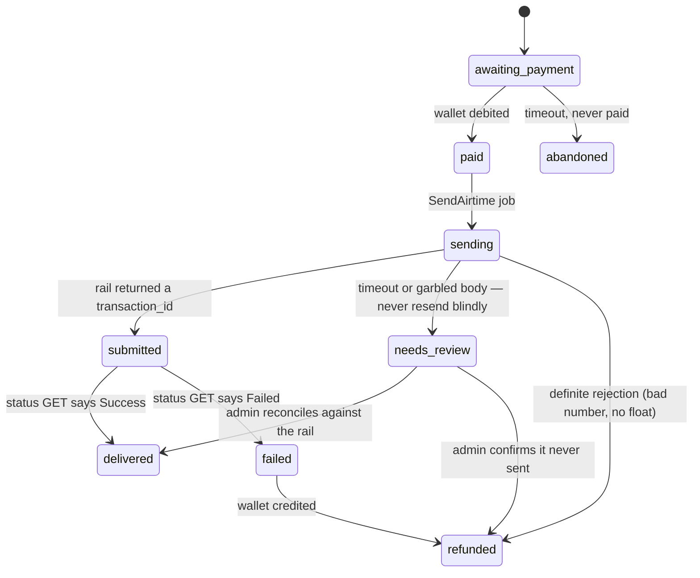

# Instalipa Airtime — selling airtime

**Status: building.** A1 (the rail: client, token cache, `Settings` keys) and the A2
core (schema, context, the send/confirm/sweep workers, and the buy screen with **bulk
buys** and **saved numbers**) are built and tested. The Instalipa credentials are set by
the super-admin, in the settings screen's **Airtime** group (or `INSTALIPA_CONSUMER_KEY`
/ `_SECRET`). Still to come: A3's callback, A4's float and limits, and the open
decisions in §14.

This is otherwise the plan for a new product line: buying airtime from Instalipa's rail
and selling it to customers. It leans hard on the shapes already in the repo (§8
payments, §6 orders, §10 float) so the new surface stays small.

The rail reference is Instalipa's own document ("INSTALIPA'S API DOCUMENTATION",
January 2026). Where this doc and theirs disagree, theirs wins.

---

## 1. What we are selling

A customer pays us in shillings, and a phone gets airtime. That is the whole product.
It looks like the shop and settles like an order — the customer pays, the thing is
delivered, the receipt is kept — but the thing delivered is not a social-media service
from a wholesale panel. It is airtime from a Kenyan aggregator, sent to a number the
customer names.

Two facts shape everything below:

- **Airtime is cash.** It is instantly spendable and instantly resellable. A delivered
  top-up cannot be recalled. That makes airtime the platform's most abusable product,
  and the abuse controls in §11 are part of the feature, not a later hardening pass.
- **We are a reseller, not the network.** Instalipa charges our float less a
  **discount**; the discount is our gross margin. We do not set the telco price and we
  cannot reverse a send.

---

## 2. Why it is not a catalog Offer

The obvious shortcut is to model airtime as an `Offer` with a `Lane`. It does not fit:

| | Social order (`orders`) | Airtime |
| --- | --- | --- |
| What is bought | an offer + grade + quantity | a shilling amount to a phone |
| Cost | USD micros per 1,000, converted at a snapshot FX | KES face value less a KES discount |
| Supplier | one of three SMM panels | one rail (Instalipa) |
| Delivery | link + quantity, takes minutes to days | a phone, seconds, irreversible |
| Failure | partial is normal and refundable | all-or-nothing; a wrong number is not refundable |
| "Refill" | yes | meaningless |

Forcing it into `orders` would mean six nullable columns, an FX snapshot that does not
apply, and every existing query — margin, observability, the rollups — learning to skip
a row it has no business touching. It gets its **own table and its own context**
(`ViewNinjas.Airtime`), and reuses the money machinery around it (§7).

---

## 3. The rail, as we have to implement it

Base URL `https://business.instalipa.co.ke`. REST, JSON, HTTPS only.

### 3.1 Auth — a token we have to cache

`POST /api/v1/token` with `Authorization: Basic base64(consumer_key:consumer_secret)`
and no body returns an `access_token` good for **1 hour** (`expires_in: 3600.0`). Every
other call carries `Authorization: Bearer <token>`.

This is the one piece that does not exist anywhere in the repo yet: payments use a
static bearer (`Malipo` sends the secret key directly). So airtime needs a small
**token cache** — a process that holds the token and its expiry, refreshes with a margin
(≈55 minutes, not 60), and refreshes once on a `401`. It must not call for a token per
request, and it must not be read from or written to the database.

### 3.2 Send — the one call that spends money

```
POST /api/v1/airtime
Authorization: Bearer <token>
Content-Type: application/json
Idempotency-Key: <our key>          # optional but we always send it

{ "phone_number": "254705340183", "amount": "100", "reference": "airtime-<id>" }
```

The response is the transaction:

```json
{ "transaction_id": "INSTAid_…", "status": "Submitted", "details": "Pending",
  "phone_number": "254705340183", "amount": "5.00", "discount": "0.30",
  "balance": "470.00", "reference": "order_…", "receipt": "" }
```

`status` here is **Submitted** — an accepted request, not a delivered top-up. Delivery
is confirmed later (§3.3, §3.4). `discount` is our margin on this transaction and
`balance` is our float after it; both are worth storing even though nothing acts on
them yet, because they are the only per-transaction cost and float facts we get for
free.

### 3.3 Callback

If a callback URL is registered in the Instalipa portal, a `POST` arrives when the
transaction moves from Pending to Success or Failed, carrying the same fields plus a
`receipt`. We must answer `200` quickly.

**The callback carries no signature** in the document. So, exactly as with Malipo, treat
it as a **hint**: on a callback, enqueue the confirming status query and let *that*
decide. Do not mark a top-up delivered off the callback body alone.

### 3.4 Status — the source of truth

```
GET /api/v1/status/<transaction_id>   →  status: Success | Pending | Failed
```

This is what flips an airtime order to delivered or failed, on a poll and on a callback
alike. It is the only thing allowed to move money (§8's rule, reused verbatim).

### 3.5 Idempotency — and its trap

Instalipa dedupes on **reference + Idempotency-Key** within a **15-minute** window and
answers `{"status": "Failed", "details": "Duplicate request"}` for a repeat — note this
is an HTTP-level shape, not the transaction status, and must not be read as "the top-up
failed".

The trap is the mirror image of Malipo's: a *retry* must **reuse** the key (so a network
blip does not send twice), but a customer genuinely buying the same number twice must
get a **new** key. So the key belongs to the *intent* — one airtime order, one key —
not to the customer or the number.

### 3.6 Amounts and errors

`amount` is **whole shillings** (the samples write `"5.00"` and `"100"`; the field is
documented whole-numbers-only). Our ledger is integer cents, so amounts are constrained
to multiples of 100 and converted with `Decimal`, never a float — the same rule §7
holds every other price to. Status codes are the conventional HTTP set plus the
transaction statuses Success / Submitted / Pending / Failed.

**Unknowns to confirm with Instalipa before building** (see §14): the min and max amount,
whether decimal amounts are truly rejected, whether the callback can be signed, the
discount's exact basis, and how a settlement statement or report is obtained.

---

## 4. Where it lands

| Piece | Module | Mirrors |
| --- | --- | --- |
| Rail behaviour | `ViewNinjas.Airtime.Provider` | `ViewNinjas.Payments.Provider` |
| Rail client | `ViewNinjas.Airtime.Instalipa` | `ViewNinjas.Payments.Malipo` |
| Token cache | `ViewNinjas.Airtime.Instalipa.Token` | new (nothing to mirror) |
| Context | `ViewNinjas.Airtime` | `ViewNinjas.Orders` / `ViewNinjas.Payments` |
| Schema | `ViewNinjas.Airtime.AirtimeOrder` | `ViewNinjas.Orders.Order` |
| Send job | `ViewNinjas.Workers.SendAirtime` | `ViewNinjas.Workers.CreatePayment` + `PlaceOrder` |
| Confirm job | `ViewNinjas.Workers.ConfirmAirtime` | `ViewNinjas.Workers.ConfirmPayment` |
| Sweep | `ViewNinjas.Workers.SweepPendingAirtime` | `ViewNinjas.Workers.SweepPendingPayments` |
| Float check | `ViewNinjas.Workers.CheckAirtimeFloat` | `ViewNinjas.Workers.CheckSupplierBalance` |
| Callback | `ViewNinjasWeb.AirtimeCallbackController` | `ViewNinjasWeb.MalipoCallbackController` |

The client follows `Malipo` exactly: Finch (via the shared `ViewNinjas.Finch`), tuples
in and out, no state, credentials from `Settings`, errors normalized to terms with a
`error_message/1` that is safe to show a customer. The **only** departure is the token:
where `Malipo` puts the bearer in from config, `Instalipa` asks the token cache, and on
a `401` refreshes once and retries.

---

## 5. Data model

Two tables, both additive; no existing table changes shape except two small ledger
additions (§7).

```
airtime_orders
  user_id            references(users)            not null
  phone              string                       not null   # recipient, canonical 254…
  amount_cents       integer                      not null   # face value, whole KES
  state              string                       not null   # §6
  reference          string                       not null   # "airtime-<id>" — unique
  idempotency_key    string                       not null   # one per intent
  instalipa_id       string                                  # transaction_id, unique
  instalipa_status   string                                  # raw word: Submitted, Pending, Success, Failed
  discount_cents     integer                                 # our margin, from the rail
  float_cents        integer                                 # our float after the send, as reported
  receipt            string                                  # airtime receipt code
  failure_kind       string
  failure_message    string
  timestamps

  unique index (reference)
  unique index (instalipa_id) where not null
  index (user_id, inserted_at)
  index (state, inserted_at)                 # the sweep

airtime_events
  airtime_order_id   references(airtime_orders, on_delete: :delete_all)   not null
  from_state         string
  to_state           string                     not null
  reason             string
  actor_id           references(users, on_delete: :nilify_all)
  timestamps
  index (airtime_order_id, inserted_at)

saved_recipients
  user_id            references(users, on_delete: :delete_all)   not null
  phone              string                      not null   # canonical 254…
  label              string                                 # "Mum", optional
  last_used_at       utc_datetime
  timestamps

  unique index (user_id, phone)               # saved once per customer
```

`discount_cents` and `float_cents` are nullable and never invented — the rail either
reported them on this transaction or it did not. `float_cents` on the newest row is also
the cheapest float reading we have (§10).

---

## 6. States



The vocabulary is deliberately `delivered`, not `completed`, and `refunded` means the
wallet was credited back — the same promise `orders` makes, in words that fit airtime.

Two rules carry over from §5 of `scope.md` and are non-negotiable here:

- **An unknown send is first-class.** A timeout on `POST /airtime` does not mean the
  airtime did not go out. It goes to `needs_review`; the job never sends again.
- **Only the status GET moves money.** The callback enqueues the GET; it does not decide.

---

## 7. Paying for it — wallet-first

The customer's money and Instalipa's money are two different ledgers, and the cleanest
way to keep them apart is to reuse the one we already trust:

1. The customer buys airtime. It is paid **from the wallet** — the same instant debit
   `Orders.pay_from_wallet/1` does today.
2. If the wallet is short, the buy screen offers **"top up and buy"**, which is exactly
   checkout's existing shortfall path: a `payments` row with `purpose: :topup`, the
   M-Pesa prompt, and on settlement the wallet is credited and the buy continues.

**This needs no new payment code at all.** `payments`, `ConfirmPayment`, the sweep, and
the top-up sheet are untouched; airtime just consumes a wallet balance like an order
does. The alternative — a dedicated `purpose: :airtime` that prompts and, on settlement,
debits and sends in one step — is a better single-tap UX and about a day's work, but it
reopens the payment funnel. Ship wallet-first, add the direct prompt if the two-step
proves annoying (§14, decision 4).

### Ledger

Add two reasons to `LedgerEntry.@reasons` (`:airtime`, `:airtime_refund`) with labels,
and an `airtime_order_id` FK on `ledger_entries`:

```elixir
add :airtime_order_id, references(:airtime_orders, on_delete: :nilify_all)
create unique_index(:ledger_entries, [:airtime_order_id, :reason],
         where: "airtime_order_id IS NOT NULL",
         name: :ledger_entries_airtime_reason_index)
```

That partial unique index is the same trick §8 uses for payments and orders: the
database itself refuses a second debit or a second refund for one airtime order, so a
replayed job cannot double-charge or double-refund.

**The refund line.** A `refunded` airtime order credits the wallet in full. A delivered
top-up is never refunded, even to a wrong number (§11). This is a policy, and the UI has
to say it before the customer pays.

---

## 8. The customer surfaces

- **A buy screen**, e.g. `/airtime`. Recipient numbers (one per line, so a **bulk buy**
  is the same form as a single one), amount in whole shillings with preset chips, and a
  confirmation step that names the numbers and amount back before any money moves.
  Airtime is irreversible; the confirmation is not optional. Each recipient becomes its
  own order, all sharing one `batch_id`.
- **Saved numbers**: the customer keeps the numbers they top up often, and the buy
  screen offers them back as a picker that drops one into the list. Managed on the same
  screen (add with an optional name, remove). One number is saved once per customer.
- **A receipt**: amount, number, the airtime receipt code, and the rail's reference,
  shown on success and kept on the order.
- **The orders list** gains airtime rows, or a sibling list, so "where did my shillings
  go" has one obvious answer.
- **The bottom tab bar stays four tabs.** Airtime is a thing you buy, so it belongs under
  the shop or a card on Home, not a fifth tab (§14, decision 6).

Placement in `router.ex` follows the existing scopes: the buy screen and its receipt in
the authenticated `live_session :require_authenticated_user` (a purchase needs an
account and a verified phone), nothing public.

---

## 9. The back office

A single `/admin/airtime` screen, staff-reachable like the others, showing:

- **The float** (KES) and when it was last confirmed, with a **pause/resume** toggle.
- **Transactions**, filtered by state, with `needs_review` first — that is the queue that
  needs a person.
- **A reconcile action** for `needs_review`: paste the rail's `transaction_id`, confirm
  delivered or never-sent. Delivered reconciles to `delivered`; never-sent refunds.

Super-admin only, in the money group: **the limits** — min and max amount, the daily
per-customer cap, and the float floor (§10, §11) — and the rail credentials.

---

## 10. Float, alerts, and the kill switch

Instalipa deducts from a prepaid **float**. When it runs out, sends are rejected — after
we have taken the customer's money. So the float has to be watched and selling stopped
before it empties — but the API in the document has **no balance endpoint**. The only
float readings it gives are the `balance` field on a send response, and whatever the
portal shows. That shapes the check:

- **Learn it from sends.** Every send response carries `balance`; store it on the row
  (§5) and treat the newest one as the current float. No extra call, no guessing.
- **Nothing to probe while idle.** With no balance endpoint, an idle shop cannot refresh
  the float on a timer the way a supplier panel can. Either confirm with Instalipa that
  a balance/statement endpoint exists (§14, decision 9) and probe that, or keep the floor
  generous and let the super-admin enter the float by hand from the portal.
- Pause: below a configured floor (e.g. KES 5,000), flip **selling off** — the buy screen
  shows airtime as paused *before* payment, exactly as a paused lane goes off sale. A
  paused airtime rail refuses `create`, never a late failure.
- Alerts (`Alerts.publish/3`): `:airtime_float_low`, `:airtime_float_out`,
  `:airtime_send_failed` (a burst), and `:airtime_needs_review` (any new one).

The alert panel already exists; these are new kinds.

---

## 11. Abuse, limits, and the refund line

This is the part that decides whether the feature is safe to ship. Airtime converts
wallet money to cash instantly, so it is the natural way to move value out of a stolen
account, launder M-Pesa, or turn a compromised wallet into untraceable airtime.

Controls, all of them real:

- **Verified phone required**, and an account that can already pay — the same gate
  checkout uses. A brand-new unverified account cannot buy airtime.
- **Per-customer velocity and caps**: N airtime orders per hour and a daily KES ceiling,
  through `RateLimit` with a new bucket, plus a hard cap enforced in the context (not
  only the UI).
- **Per-recipient-phone cap**: the same total shillings per hour/day to any one number, so
  one compromised account cannot pump a single phone.
- **A recipient that is not the account's own number** is allowed (people top up family),
  but it is the higher-risk case and should carry the tighter cap and an alert on volume.
- **A short dwell after funding**: consider refusing airtime for a number funded by a
  top-up in the last few minutes, or at least alerting — the "just got a prompt, now
  buying airtime to another number" pattern is the fraud signature (§14, decision 7).
- **Kill switch**: the pause in §10 stops the whole line in one tap.

Refund policy, stated plainly and enforced: **a delivered top-up is never refunded.** We
cannot recall airtime and we will not eat the loss for a typo. The confirmation step,
naming the number, is the only protection, so it must be there.

---

## 12. Failed and unknown sends

- **Definite rejection** (bad number, no float, duplicate): record the rail's reason,
  `refunded`, credit the wallet. The customer is made whole immediately.
- **Timeout or garbled body**: `needs_review`. Do **not** resend. If the rail returned a
  `transaction_id` before the body broke, the status GET resolves it; if not, a person
  reconciles against the Instalipa portal and the float movement. Never a second send on
  the same intent.
- **Duplicate request** (`{"status":"Failed","details":"Duplicate request"}`): this is
  our own retry landing twice, not a failed top-up. The first request's row is the truth;
  resolve via status, then refund only if the first genuinely failed.

The sweep (`SweepPendingAirtime`) re-enqueues the confirming GET for anything
`submitted`/`pending` past a window, with an upper bound past which it stops probing and
hands the row to a person — the same two bounds `SweepPendingPayments` uses.

---

## 13. Settings

Registered in `ViewNinjas.Settings` (§7 registry), super-admin set, secrets masked:

| Key | Purpose |
| --- | --- |
| `instalipa_base_url` | `https://business.instalipa.co.ke` |
| `instalipa_token_path` | `/api/v1/token` |
| `instalipa_airtime_path` | `/api/v1/airtime` |
| `instalipa_status_path` | `/api/v1/status/{id}` |
| `instalipa_consumer_key` | secret |
| `instalipa_consumer_secret` | secret |
| `airtime_min_cents` / `airtime_max_cents` | the amount bounds |
| `airtime_float_floor_cents` | the pause threshold (§10) |
| `airtime_markup_bps` | optional: sell above face, not only earn the discount |
| `airtime_daily_cap_cents` | per-customer daily ceiling (§11) |
| `airtime_selling` | the kill switch |

Credentials live in `Settings` (encrypted at rest), never in `config` or the repo, and the
consumer secret is never logged — the log line carries host, path and status only, as
`Malipo` does.

**Economics decision.** Default to **selling at face value** and earning Instalipa's
discount as margin: KES 100 of airtime for KES 100. `airtime_markup_bps` exists so a
super-admin *can* add a margin on top, but it should default to zero — marking airtime up
is how you become the expensive option in a market where everyone knows the price.

---

## 14. Open decisions

1. **Are we selling at face value?** (Recommended: yes; margin is the Instalipa discount.)
2. **Min/max amount, and denominations** for the preset chips. Confirm with Instalipa.
3. **Who can buy?** Verified account only, or any signed-in account? (Recommended: verified.)
4. **Single-tap M-Pesa for airtime**, or wallet-first + top-up-and-buy? (Recommended: wallet-first.)
5. **Recipient scope**: own number only in v1, or any number? (Recommended: any number,
   tighter caps, alerts.)
6. **Where it lives**: a Shop card, a Home card, or its own `/airtime` route reached from
   both? (Recommended: `/airtime`, linked from Home and the Shop.)
7. **Dwell rule** after funding (§11): refuse, warn, or only alert? Needs a fraud call.
8. **Callback signing**: confirm none, and rely on the status GET (Recommended), or ask
   Instalipa for a signature.
9. **Float funding and top-ups**: how the float is replenished and by whom, and whether
   the admin screen should show a low-float recharge reminder.
10. **Reporting**: per-transaction discount is in the send response, but there is no
    statement in the document — confirm how fees/settlement are reported before scoping
    a profit line for airtime (§10 of `malipo-connect.md` has the same gap).

---

## 15. Milestones

- **A1 — done.** Token cache, client, `Provider` behaviour, `Settings` keys. No money.
- **A2 — done (bulk + saved numbers included).** Schema, context, states, the buy screen,
  the wallet debit, the send/confirm/sweep workers, the receipt. Failures refund the
  wallet. Polls; no callback yet.
- **A3 — The callback.** The callback controller that enqueues the confirming status
  query, so a delivery flips without waiting on the poll. The status GET is already the
  source of truth, and `needs_review` is already parked for a person.
- **A4 — Float and limits.** Float probe, pause, alerts, the caps and velocity in §11,
  the admin screen.
- **A5 — Optional.** Direct M-Pesa-for-airtime (decision 4), markup (decision 1),
  reporting (decision 10).

Each milestone is shippable alone; A2 without A3 is a working product that polls, which
is where `malipo-connect.md` landed too.

---

## 16. Out of scope for v1

- Sending airtime *to* a customer as a refund or promo (that is a disbursement, a
  different abuse profile).
- Reselling airtime to other businesses / a reseller API.
- Data bundles, SMS bundles, or any non-airtime telco product.
- Multi-currency, cards, or any rail other than Instalipa.
- Swahili copy (belongs with the existing i18n gap, not here).
