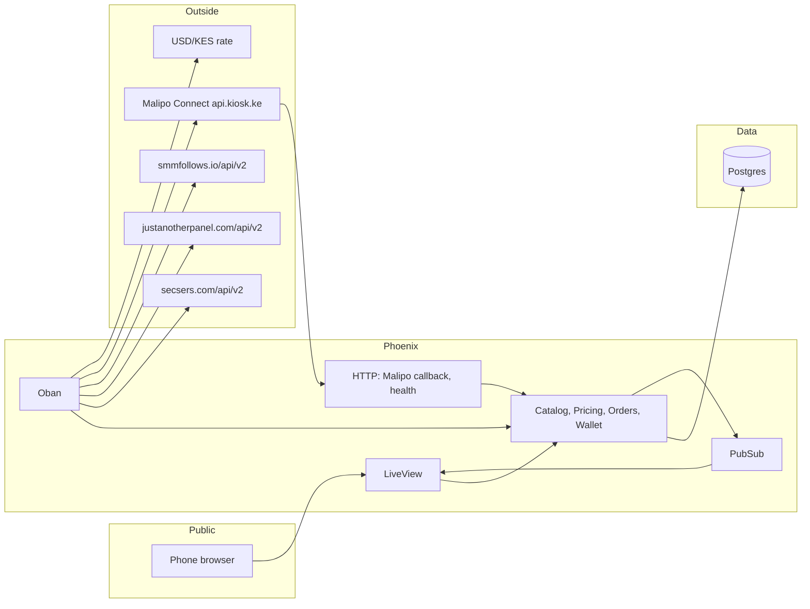
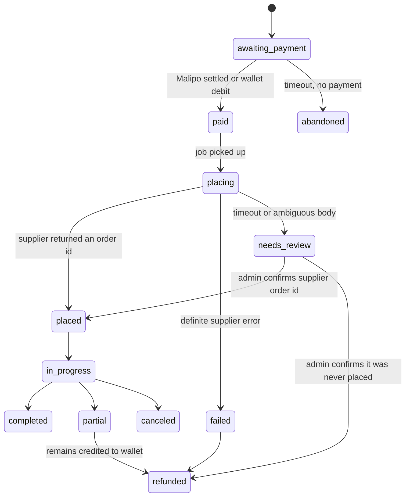

# ViewNinjas — architecture scope

A Kenyan storefront that sells social engagement in shillings. Customers sign up, pick a service, pick a grade, pay, and watch the order move. Three wholesale panels do the fulfilment. The customer never meets them.

Working name follows this repo. The public brand can change without touching the model below.

This document is the build contract: product shape, money, supplier boundary, and the order of work. It is not a schema dump and not a ticket list.

---

## 1. The product in one sentence

One catalog, priced in KES, paid by M-Pesa, fulfilled by whichever of Secsers, JustAnotherPanel, or SMMFollows was pinned to the grade the customer chose.

The panels are kitchens. ViewNinjas is the menu.

| They see | We keep |
| --- | --- |
| Instagram followers, TikTok likes, YouTube views | Supplier name, service id, USD rate |
| Cheap, Moderate, Quality | Which panel and which service id backs that lane |
| A price in KSh | Cost in USD, the FX snapshot, and the margin |
| "Processing", "In progress", "Done", "Partial" | Raw supplier status, charge, remains, start count |
| A refill button when we promised one | Whether that supplier actually supports refill |

If a customer can tell which panel filled the order, the product has leaked.

---

## 2. What a session feels like

1. Land on a short public page. Platforms, a few example prices in KSh, sign up.
2. Create an account with phone and email. Phone is the Kenyan identity; email is the recovery path.
3. Open the catalog. Filter by platform, then by outcome (followers, likes, views, comments).
4. Open one offer. See three grades side by side, each with its own price per 1,000, min, max, and whether refill is included.
5. Paste the profile or post link, pick a quantity, see the total in whole shillings before anything is sent.
6. Pay with M-Pesa (a prompt is pushed to the phone on the account, via Malipo Connect) or spend wallet balance.
7. Land on the order. Status updates without a refresh. Refill appears only after completion, and only on grades that were sold with refill.
8. Come back later. The dashboard leads with what they bought, what is still moving, and the wallet balance, and re-order is one tap. No supplier jargon, no USD.

Every screen here is a phone screen: one column, a bottom tab bar, no full reloads (§12).

Admin is a separate surface inside the same app: pin grades, watch supplier balances, intervene when placement is uncertain.

---

## 3. Grades are lanes, not discounts

Cheap, Moderate, and Quality are three different wholesale services for the same customer-facing offer. They are not the same service with three markups.

A cheap Instagram-follower service and a quality one differ in refill, speed, drop behaviour, min/max, and which panel holds the inventory. Pricing them as one SKU with a slider would lie.

```
Offer: "Instagram followers"
  ├─ cheap     → JustAnotherPanel service 18420   refill: no
  ├─ moderate  → Secsers            service 902    refill: yes
  └─ quality   → SMMFollows         service 44     refill: yes
                 (admin-pinned; never auto-selected by price alone)
                 all three sell at the same 130% margin (§7)
```

Rules that keep the lanes honest:

- A lane is empty until a human pins it, or accepts a suggestion. Empty lanes are not shown.
- Every lane is picked from the full inventory every panel sells (§9). The buyer sees the selection; they never see the inventory.
- Quality is never "the most expensive row in the sync." Expensive can just be a bad service. Quality is pinned.
- A failed cheap lane does not fall through to quality, and quality never falls through to cheap. The customer bought a grade. If that lane cannot be placed, the order fails and the shillings return to the wallet.
- Min, max, and refill on the screen come from the pinned supplier service, not from the offer. Change the pin, change the form.
- Suggestions may rank candidates (refill flag, cancel flag, sane min/max, recent completion rate). A person still confirms.

Display copy can stay the words customers already understand — Cheap, Moderate, Quality — with one plain line under each: what they are buying (speed and refill), not a fake promise of "real people."

---

## 4. System shape

One Phoenix application. LiveView for every signed-in screen. Postgres for the truth. Oban for everything that waits on the outside world. Finch for HTTP.



Astro is not in the first build. The signed-in product is stateful and live; splitting it across two front ends buys a second deploy and a catalog API before there is a catalog worth publishing. A Phoenix landing page is enough to sign up.

Add Astro later only if public SEO pages multiply — one page per platform, prices pulled from a read-only JSON endpoint, no login, no checkout. Checkout stays in LiveView.

### Why this stack fits

- **LiveView** is the order page. Status changes are server pushes. The M-Pesa wait ("check your phone") is a long-lived screen fed by a Malipo callback or a short Oban poll, not a poll loop in JavaScript.
- **Oban** is the supplier boundary. Catalog sync, placement, status batches, refill checks, FX refresh, and low-balance alerts are jobs with retries, uniqueness, and a paper trail.
- **Postgres** holds money, orders, and the FX snapshot on each order. No Redis required to ship. PubSub can run on Postgres (`Phoenix.PubSub` with the PG adapter, or the default PG notifier) until a second node forces a change.
- **BEAM processes** make a per-order status watcher natural, but a cron that batches up to 100 order ids per supplier is the better v1. The status API already accepts a comma-separated list. One HTTP call, many rows, then a PubSub broadcast per order.
- **Mobile first.** The signed-in app is a phone app that happens to be HTML: an installable PWA with a bottom tab bar and native-feeling transitions, and no desktop chrome to design around (§12).

There is no separate frontend app, no SPA, no Node service in the request path.

---

## 5. The supplier boundary

Secsers, JustAnotherPanel, and SMMFollows all speak the same dialect: `POST` form body, `action` plus `key`, JSON back. SMMFollows lives at `https://smmfollows.io/api/v2`. The other two URLs are the ones already collected.

One client. Three configs.

```elixir
defmodule Viewninjas.Suppliers.Panel do
  @callback services(config) :: {:ok, [service]} | {:error, term}
  @callback add_order(config, attrs) :: {:ok, supplier_order_id} | {:error, term}
  @callback status(config, order_ids) :: {:ok, map} | {:error, term}
  @callback refill(config, supplier_order_id) :: {:ok, refill_id} | {:error, term}
  @callback refill_status(config, refill_id) :: {:ok, status} | {:error, term}
  @callback balance(config) :: {:ok, money_usd} | {:error, term}
  @callback cancel(config, order_ids) :: {:ok, [result]} | {:error, term}
end
```

`Viewninjas.Suppliers.V2` implements that behaviour once. A supplier row is a name, a base URL, an encrypted key, and a capability set:

| Capability | Secsers | JustAnotherPanel | SMMFollows |
| --- | --- | --- | --- |
| services, add, status, balance | yes | yes | yes |
| single refill + refill_status | yes | yes | yes |
| multi status (comma, up to 100) | yes | yes | yes |
| cancel | confirm before exposing | yes | yes, same v2 shape |
| multi refill | no | yes | treat as optional |

Capabilities are data. The UI shows Cancel only when the pinned service says `cancel: true` and the supplier row says cancel is implemented. Refill is the same test against `refill: true`.

### Calls we actually use

| Action | When |
| --- | --- |
| `services` | Catalog sync, a few times a day and on demand |
| `balance` | Every few minutes. Alert before the float hits zero |
| `add` | Once, after payment is final, and only from a job |
| `status` | Batch, for every order not in a terminal state |
| `refill` | Customer tap, if the lane was sold with refill |
| `refill_status` | Until the refill settles |
| `cancel` | Admin, and only on panels that support it |

`runs` and `interval` (drip) stay out of v1. So do custom comments, packages, subscriptions, and mentions. Those types change the order form. v1 sells `type: Default` only: a link and a quantity.

### The dangerous call is `add`

`add` is not idempotent. A timeout does not mean the order was not created, and this API has no "list orders I just placed" we can trust across all three panels.

So placement works like this:

1. Persist the intent first: supplier, service id, link, quantity, and state `placing`.
2. Send `add` exactly once. Short timeout. No automatic retry.
3. On `{order: id}`, store it and move to `placed`.
4. On a definite API error (`{"error": "..."}`), move to `failed` and refund the wallet.
5. On timeout or a garbled body, move to `needs_review`. Do not call `add` again. An admin reconciles against the supplier balance movement and the panel UI.

That unknown state is a first-class status, not an exception we hope not to hit.

### Adding a fourth panel

When the panel speaks the same v2 dialect, the whole integration is a row and a key:

1. **A row.** Insert a `suppliers` row — slug, base URL, `active: false`.
2. **A key.** Paste the API key; it is encrypted at rest on write (§12). It never touches a config file or the repo.
3. **Capabilities.** Set what this panel actually supports — `services`, `add`, `status`, `balance`, `refill`, `refill_status`, `cancel`, and the multi-status limit. Capabilities gate the UI, not the sync.
4. **Prove it.** Run `balance` and `services` by hand from admin. Balance proves the key; services proves the dialect.
5. **Flip it on.** `active: true`, and the next scheduled sync begins.
6. **Ingest.** The whole inventory lands in `supplier_services`, unfiltered (§9). It can be tens of thousands of rows — a background job, never a page load.
7. **Triage and publish.** Work the new rows in the catalog workspace: shortlist, pin as grades, publish.

If it does not speak v2:

- A near variant — one renamed field, a different auth header — gets a thin adapter behind the same `Suppliers.Panel` behaviour. Do not fork the client.
- A real difference — different verbs, webhooks, a different money unit — is a new integration, not a row. Timebox a spike (build-plan S2) before promising it.

One trap worth naming: a panel that bills in a currency other than USD. §10 says stop and alert rather than convert a guess. Confirm the currency at step 4, before any lane is pinned.

---

## 6. Domain model

Postgres, integer money, snapshot everything that can drift.

### Identity

- **User** — phone in `2547…` form, email, password, role (`customer` | `admin` | `super_admin`).
- `admin` runs the catalog and orders. `super_admin` also holds the money knobs — margin, buffer, FX, rounding. One person can be both.
- Phone is unique. Login may be phone or email. v1 can be email + password plus a verified phone, because the M-Pesa prompt needs a trustworthy MSISDN. OTP login can replace the password later without a schema break.

### Catalog

- **Supplier** — `secsers` | `jap` | `smmfollows`, base URL, encrypted API key, capabilities, last balance, last balance check.
- **SupplierService** — raw sync row: supplier, external `service` id, name, category, type, rate (USD per 1,000, stored as integer micros), min, max, refill, cancel, active, `shortlisted_at` (null until an admin flags it), last seen at. Everything a panel sells lives here; nothing is filtered at ingest. Disappearance from a sync marks it inactive. It is not deleted; pins may still point at it.
- **Offer** — what the customer browses. Platform, outcome, title, description, sort, published. Example: platform `instagram`, outcome `followers`, title "Instagram followers".
- **Lane** — an offer plus a grade (`cheap` | `moderate` | `quality`) plus a pinned `SupplierService`. Unique on `(offer, grade)`. Holds an optional manual KES override; with none, the one global margin in §7 applies. Carries a published flag.

The storefront reads offers and lanes. It does not read `SupplierService` except through the lane.

### Money

- **FxRate** — USD→KES, source, fetched at. Append-only. A super-admin override is a row with an actor, not an edit.
- **PricingSettings** — singleton, append-only versions: `margin_bps`, `buffer_bps`, FX override, rounding, actor, reason, effective at. The pricer always reads the current version; nothing is edited in place.
- **LedgerEntry** — user, amount in KES cents, direction, reason (`topup`, `order_hold`, `order_capture`, `refund`, `adjustment`), reference to a payment or an order. The wallet balance is the sum of the ledger, not a column someone updates in place.
- **Payment** — one Malipo Connect attempt: phone, amount in KES cents, Malipo payment id, idempotency key, optional reference, status (`pending` | `settled` | `failed`), receipt, failure kind, failure message. A retry is a new row with a new idempotency key; the old row is kept.

KES is integer cents even though Malipo amounts are whole shillings. Charging rounds to the nearest shilling. The ledger keeps the cents so rounding is visible.

USD supplier rates are integer micros of a dollar per 1,000 units (`"0.90"` → `900_000`). No floats on either side of a price.

### Orders

- **Order** — user, offer, lane, grade, link, quantity, retail KES, cost USD micros, the margin and buffer bps in force, fx rate id, supplier, supplier service id, supplier order id, state, start count, remains, supplier status, timestamps.
- **Refill** — order, supplier refill id, state.
- **OrderEvent** — append-only log of state changes, for support and for the timeline on the order page.

States:



`Partial` is a normal outcome in this industry, not a bug. The customer sees how many remain. The unused portion returns to the wallet automatically once the supplier status is terminal, using the remains count and the KES-per-unit captured on the order. Support can override that credit; the default is to credit.

### Insight

Tables that exist to answer the super-admin's questions, not to run the storefront.

- **PageView** — one row per page view, written server-side as the LiveView mounts and, later, by a tiny first-party beacon on the Astro pages. Fields: at, path, referrer, `utm_source` / `utm_medium` / `utm_campaign`, `visitor_hash` (rotates daily, so it cannot follow a person from one day to the next), `user_id` (null when signed out), device class, app version. Append-only, short retention.
- **AnalyticsDaily** — a rollup per day: visits, unique visitors, signups, orders, revenue cents, cost cents, profit cents. Derived and rebuildable; never the source of truth.
- **Cost** — cost lines that belong to no customer: `kind` (`hosting` | `domain` | `other`), amount cents, incurred on, note. SMS cost already lives on `sms_messages` and the payment fee on `payments` (`fee_cents`, nullable — reconcile it from the Malipo settlement rather than assume a rate), so those two are derived, not re-entered here.
- **Target** — a goal for the progress screen: metric, period (`day` | `week` | `month`), value, set by, effective at. Append-only, like the money knobs.

Profit is derived, never stored as one number: revenue (settled, net of refunds) − the real USD `charge` per order converted at that order's snapshot FX − payment fees − SMS − other costs. §10 states it; §11 puts it on a screen.

---

## 7. Pricing

Suppliers quote USD per 1,000. Customers pay whole shillings. One margin, flat across every service — **130% over landed cost**, so retail is 2.3× what the units cost us landed. A grade changes which wholesale service backs it, not the markup we apply, so the price gap between Cheap and Quality is the real cost gap with nothing stacked on top. The conversion is frozen onto the order at the moment of payment, never recomputed when the order later completes.

All of it is integer arithmetic — no floats on either side of a price, the same rule §6 holds the rates to.

```
# ppm = parts per million, bps = basis points. Every value is an integer.
rate_ppm     = supplier rate   # USD per 1,000 units, × 1e6   ("0.90" → 900_000)
fx_ppm       = fx rate         # KES per USD, × 1e6           (129.40 → 129_400_000)
buffer_bps   = 300             # 3%, every service
margin_bps   = 13_000          # 130%, every service

cost_usd_ppm = rate_ppm * quantity / 1000
cost_kes_ppm = cost_usd_ppm * fx_ppm / 1_000_000
landed_ppm   = cost_kes_ppm * (10_000 + buffer_bps) / 10_000
retail_ppm   = landed_ppm * (10_000 + margin_bps) / 10_000
retail_kes   = round_to_shilling(retail_ppm)   # ppm → whole shillings, half up
```

Worked example — a cheap lane backed by a `0.90` USD-per-1,000 service, at FX `129.40`, for 1,000 units:

```
cost_usd_ppm = 900_000            # 0.90 USD
cost_kes_ppm = 116_460_000        # 116.46 KES
landed_ppm   = 119_953_800        # 119.95 KES   (cost + 3% buffer)
retail_ppm   = 275_893_740        # 275.89 KES   (landed × 2.3)
retail_kes   = 276                # KSh 276
```

Both knobs are settings, not constants. A super-admin changes them from the admin surface — no deploy — and the defaults ship as 130% margin and 3% buffer:

| Setting | Default | Scope |
| --- | --- | --- |
| `margin_bps` | 13,000 — 130% over landed | Every lane |
| `buffer_bps` | 300 — 3% | Every lane |
| FX rate | daily mid-market, super-admin override | Whole catalog |
| Rounding | nearest shilling, half up | Every quote |

Every change is a new audited version (who, from, to, when). A change re-quotes the catalog; each order still snapshots the margin, buffer, and FX it was priced with, so a later edit never moves a price a customer already paid.

The buffer exists because the USD float is bought before the customer pays, and the shilling moves. It is not profit. Profit is the flat margin, and it should stay visible on the order row so a week's trading can be summed.

One margin is what keeps the lanes honest. There is no discretionary markup hiding in the Quality price: when a lane looks expensive, it is because the service underneath it is expensive.

Guardrails:

- A lane can set a manual KES price that ignores the formula. The escape hatch for psychological points (`KSh 199`, `KSh 299`) and for the rare service the flat margin misprices. It is the exception, not the rule.
- Retail can never be below landed cost. The pricer refuses to publish a lane whose manual price sits at or under landed-plus-buffer.
- The margin is one setting, not a per-lane field. Changing the business margin is one number, not a hand re-price of every lane.
- Flat margin means retail moves only with supplier cost and FX, and both are snapshotted onto the order. A paid order never re-prices; a lane whose cost moved is flagged `stale` for admin on the next sync (§9), before the next customer is quoted.
- If the pinned service goes inactive or its min/max no longer contains the quantities we advertise, the lane unpublishes itself on the next sync and an admin alert fires.
- Quantity outside min/max is rejected in the form, using the live pin, before a payment exists.

Show the price as `KSh 1,250`, never `KES 1250.00`, and never USD.

---

## 8. Payments

M-Pesa is the product. Cards are a later door.

Malipo Connect is the rail. We do not build against Daraja directly: no Daraja app, no passkey to hold, no webhook to register. We confirm where money lands once, in Connect, and it hands us an `sk_live_…` key and a base URL (`https://api.kiosk.ke`). The request/response contract lives in `malipo-connect.md`; this section is how it fits the app.

Two ways to pay, one ledger:

1. **Pay this order.** Default for a first purchase. A prompt is pushed to the phone for the exact shilling total. On success the order is `paid` and placement starts. There is no leftover balance unless a later refund creates one.
2. **Wallet.** For repeat buyers. A prompt tops up the ledger. Checkout debits the ledger inside the same database transaction that marks the order `paid`.

One attempt is one `POST /v1/payments` with `amount`, `customer_phone`, and an `idempotency_key`:

- The `idempotency_key` is per checkout attempt (`order-1042-1`). Re-sending the same key after a timeout returns the original payment and never prompts twice. A retry after a failure is a new key (`order-1042-2`).
- `reference` is our order or ledger id. It comes back on the payment and on the callback, which is how a callback finds its row without a lookup table.
- `callback_url` is optional. Set it and Malipo pushes the result; omit it and we poll.

The wait:

1. LiveView asks the customer to confirm the phone on the account.
2. We call Malipo to create the payment and store the Malipo payment id.
3. The screen stays open: "A prompt is on your phone." PubSub flips it when the result lands. The prompt is open for about 90 seconds; a payment the customer never completes ends `failed`, not stuck.
4. The result arrives one of two ways: Malipo POSTs our `callback_url`, or an Oban poller calls `GET /v1/payments/{id}` on a timer.
5. Either way, we confirm with `GET /v1/payments/{id}` and mark the payment `settled` only when that GET returns `settled`. Then we write the ledger and enqueue placement.

A callback is a hint, not the truth. A replayed or forged POST must not move money on its own, so the confirming GET is the gate. The callback controller is a plain Phoenix controller, not a LiveView: it answers `2xx` fast and does the real work in Oban, because Malipo retries when it does not get a quick `2xx`.

Statuses map straight onto our states:

| Malipo | Payment | Order |
| --- | --- | --- |
| `pending` | pending | `awaiting_payment` |
| `settled` | settled | `paid`, then placement |
| `failed` | failed | `awaiting_payment`, retryable |

`failed` carries `failure_kind` and `failure_message`. `customer_declined`, `subscriber_cancelled`, `customer_timeout`, `insufficient_funds`, and `wrong_pin` are the customer's to see and fix; `timeout`, `expired`, and `rail_failure` are ours to retry. In every case the order stays `awaiting_payment` and nothing has been sent to a panel. Show `failure_message` and offer a new attempt with a new `idempotency_key`.

Do not place a supplier order on `pending`. `pending` only means the prompt is out, or M-Pesa has not reported yet. Placement waits for `settled` and a receipt.

The client is a thin module over Finch (`Viewninjas.Payments.Malipo`) — create and get, no state. Secrets (`sk_live_…`, and the `whsec_…` signing secret if we verify callbacks) come from config and never appear in logs.

---

## 9. Catalog sync and curation

Sync is a pull, not a webhook. None of the three panels will tell us when a service changes.

**Integrating a panel is wholesale.** The moment a key is added, the next sync pulls *every* service that panel sells — the whole inventory, unfiltered — into `supplier_services`, and it is browsable and searchable in admin. We do not decide on the way in what is worth having: filtering at ingest hides the rate movements, and it means a reconsideration costs a re-sync.

A scheduled job per supplier:

1. `action=services`.
2. Upsert by `(supplier, external_id)`.
3. Record rate, min, max, refill, cancel, name, category, type.
4. Anything missing from this pull becomes inactive.
5. Any lane pinned to a row that changed price, bounds, or active flag is flagged `stale` for admin. Price changes do not silently change what customers pay until the lane is re-priced; the old retail holds, and if it would now sell below cost the lane unpublishes.

Three tiers, and only the third is visible to a buyer:

| Tier | What it is | Who sees it |
| --- | --- | --- |
| Ingested | every service from every panel | admin only |
| Shortlisted | an admin flagged it worth considering (`shortlisted_at`) | admin only |
| Published | pinned as a grade on a published offer | the buyer |

Curation is the actual product work, and it is selection, not creation — an admin LiveView over the full synced inventory:

- Search and filter by panel, category, refill, bounds, and computed KES cost.
- Shortlist as you triage. This is a reading aid; it changes nothing a buyer sees.
- Place the decision: pin a service as Cheap, Moderate, or Quality on an offer, price it, publish it.
- Suggestions rank candidates (cheapest refillable, cheapest of any kind, name match). Suggestions are not auto-published — not by price, not by name.

A service that is not shown to buyers is still synced and still tracked for rate and active, so re-publishing it later needs no re-sync.

### The workspace, in shape

```
Catalog workspace (admin)
---------------------------------------------------------------
search [ follower        ]  panel [ all v ]  category [ followers v ]
filter [x] refill  [ ] cancel   cost <= [     ] KSh   sort [ cost ]
---------------------------------------------------------------
    JAP     18420   IG followers - real       0.90 USD -> 276 KSh   [pin]
  * Secsers   902   IG followers - refill     1.20 USD -> 338 KSh   [pin]
    SMM        44   IG followers - refill     2.40 USD -> 662 KSh   [pin]
    JAP     18421   IG followers - drop       0.85 USD -> 271 KSh   [pin]
---------------------------------------------------------------
selected JAP 18420    place as: (cheap) (moderate) (quality)
pin to offer [ Instagram followers v ]                   [ Publish ]
---------------------------------------------------------------
```

The list is *ingested*. A `*` is *shortlisted*. `Publish` is the only thing a buyer can ever see. The KES figure is the pricing engine (§7) run live, so a pin is never a guess about what it will cost.

Expect thousands of raw services and a few dozen offers. The map is small on purpose. Publishing the raw catalog would dump USD names, duplicates, and junk SKUs onto a Kenyan customer.

Platform and outcome can be guessed from category and name with a simple rules table (`"instagram"` + `"follower"`). Guessing fills the suggestion strip and the shortlist. It does not publish.

---

## 10. After the sale

**Placement job.** Unique on order id. Runs the single `add`. Broadcasts the new state.

**Status job.** Every minute, group non-terminal orders by supplier, chunk by 100, `action=status` with `orders`. Map supplier words onto our states:

| Supplier `status` | Our state |
| --- | --- |
| Awaiting, Pending | placed |
| In progress, Processing | in_progress |
| Completed | completed |
| Partial | partial |
| Canceled, Refunded | canceled |
| anything else | keep previous, store the raw string, surface in admin |

Also store `start_count`, `remains`, `charge`, and `currency`. The USD `charge` is the actual cost and should be written back onto the order so margin is real, not estimated. If `currency` is ever not USD, stop and alert rather than converting a guess.

**Refill.** Button on a completed order whose lane was sold with `refill: true`. One refill record, one supplier call, then `refill_status` until Completed or Rejected. Rejected is visible and does not automatically open a second refill.

**Supplier float.** Balance job. If a supplier drops under a threshold (start at a configured USD floor), alert and stop new placement on lanes pinned to that supplier. In-flight orders keep syncing. The customer of a new order on that lane gets a clear "this grade is paused" before payment, not a failure after they have paid.

**Profit.** The status job already writes the supplier's real USD `charge` onto every order. Convert it at the FX snapshotted on that order, subtract it from the captured retail, and you have realised gross profit for that order; sum the month for the headline. Then take out the variable costs — the Malipo fee on each payment and the SMS that carried each OTP — and the fixed ones — hosting, domain. What is left is the number the super-admin actually watches, and §11 puts it on a screen.

Wallet is a liability, not revenue. A top-up is cash in, but revenue is recognised when an order is captured, whether it was paid by prompt or from the wallet — once, never twice. A partial order earns on the delivered share only, because the remainder went back to the wallet.

---

## 11. The three surfaces

Three pages carry the product, one audience each: **the market**, **the buyer dashboard**, and **the super-admin**. Nothing else earns a route.

### 1. The market — the homepage

Public, no account. The shopfront and the pitch in one screen.

- One line of what this is, the three grades in plain language, and the platforms we cover.
- The live catalog: platform chips, then offers, each with a real from-price pulled from a published cheap lane. Browsing is open; buying needs an account.
- No invented prices. A lane that is not published is not shown, and an offer with no published lane is not shown either (§7, §9). Fake numbers rot.
- Sign up and log in, reachable in one tap from anywhere, plus forgot password.
- This is the page Astro takes over later if public SEO pages multiply (§16). Until then the LiveView version is right.

### 2. The buyer dashboard — the app

The signed-in home, and the reason a returning customer opens the app instead of a browser tab.

**The stats strip** — real numbers from real rows, not decoration:

| Stat | Source | Why it earns the space |
| --- | --- | --- |
| Wallet balance | `sum(ledger_entries)` | Spendable now; the repeat-buy habit |
| In progress | orders not terminal | "Is it moving?" |
| Delivered this month | `sum(quantity)` over orders completed this month | The emotional number — what they actually bought |
| Refills available | completed orders sold with refill, not yet refilled | The promise on the tin |
| Credit from partials | refund entries this month | Money came back without them asking |
| Total spent | captured `retail_cents` | Light, honest, all-time |

Below the strip, in this order:

- **Re-order.** One tap repeats a past offer with the same link and quantity. For this market this is the highest-value button in the app: the same customer buys followers for the same profile again and again. It is the buyer-side twin of the supplier `add`.
- **Active orders**, live over PubSub, each a card that opens the timeline.
- **A nudge** when a payment is still awaiting, or a refill is ready.

Four bottom tabs, thumb-first (§12): **Home, Shop, Orders, Account.**

- **Home** — the dashboard above.
- **Shop** — the same catalog as the market, already signed in.
- **Orders** — list and detail timeline, refill when allowed, the M-Pesa receipt.
- **Account** — phone and verification, saved links, notification preferences, the wallet ledger, log out.

Buying runs Shop → Offer (three grades, quantity, link, live total) → pay → the full-screen M-Pesa sheet (§12) → the order. Wallet lives on Home as a balance card and in Account as the full ledger; it does not need its own tab.

### 3. The super-admin — the back office

Answers two questions: is the machine healthy, and is it earning. Role-gated — `admin` runs the catalog and orders, `super_admin` also holds the money knobs (§6).

**The overview** — the business in one screen, in three panels.

**Profit.** The P&L, from §10:

- Revenue (settled, wallet-funded orders counted once), cost of goods (the real USD charge at each order's snapshot FX), gross profit, and margin %.
- Variable cost — Malipo fees and SMS — and fixed cost — hosting, domain. Net profit, with the delta against the same period last month.
- Today, this week, and month to date, with a trend line and the break-even line drawn on it: how many orders at the current margin cover the fixed costs.

**Progress.** Goals against reality, because a number without a target is trivia:

- A `Target` per metric and period — revenue, orders, new customers, margin % — shown with the actual, the delta, and the days left.
- The streak that matters here: consecutive days with at least one settled order.
- The repeat rate: the share of customers who order again within 30 days.

**Traffic.** First-party only (§6, §13):

- Visits and unique visitors for today, 7 days, and 30 days, with the trend.
- The funnel — home → offer → checkout started → payment settled → order placed — with the conversion at each step and the biggest leak called out.
- Sources: referrer and `utm_*`, and which SMS or campaign link brought them.
- Top offers viewed against top offers bought — the gap between interest and sales.
- Device and network class, because a mid-range Android on 3G is the real customer.

Then the working screens:

- **Suppliers** — balance, last sync, error rate, paused flag.
- **Catalog** — the full synced inventory from every panel, searchable and filterable; shortlist candidates, then pin one as a grade and publish. The stale flag lives here.
- **Orders** — filter `needs_review` and `partial`; attach a supplier order id, or refund.
- **Pricing** — the margin, buffer, FX rate (auto or overridden), and rounding in force, with the history of every change. **Super-admin only.**
- **Costs and targets** — the cost lines and this period's goals. **Super-admin only.**
- **Customers** — find by phone, read-only ledger, manual adjustment with a reason.
- **Audit** — who changed a price, who moved money, and when. Every admin action is timestamped onto the charts, so a move in revenue has a visible cause.

Two habits, so the numbers come to you:

- **A weekly digest** — one message to the super-admin every Sunday night: profit, orders, new customers, conversion, the best lane, and anything that alerted. It is the report you read even when you do not open the back office.
- **Anomaly alerts** — settled-rate drops, a spike in one `failure_kind`, OTP delivery slipping, a lane whose margin went negative, traffic falling off a cliff. An alert, not a chart you have to notice.

No admin action should be "edit the wallet column." Adjustments are ledger entries. The money knobs — margin, buffer, FX, rounding — are the super-admin's, and they are append-only versions rather than edited values.

---

## 12. Mobile first

This is a phone app that happens to be HTML. It is used on a mid-range Android, one-handed, often outdoors, on a 3G connection, by someone who may never have used a website for this before. It should feel like the apps already on their home screen, not like a page in a browser.

Not a native app. No React Native, no Flutter, no app-store build in v1 (§16). A LiveView app with a PWA shell gets there faster, the M-Pesa prompt is on the phone anyway, and the app is only the shop window around it.

What "looks like a real app" means here:

- **One column, thumb-first.** Design from a 360×640 viewport up. A fixed bottom tab bar — Home, Shop, Orders, Account — inside the thumb arc. No hamburger, no desktop sidebar. Tablet and desktop get the same column, centred, not a second layout.
- **Installable.** A web app manifest, maskable icons, `display: standalone`, `theme-color`, an offline splash, and a first-run add-to-home-screen prompt. Launched from the home screen it has no URL bar, so it reads as an app.
- **No reloads.** LiveView already holds the connection; add the View Transitions API for push/pop feel, so Shop → Offer → Order slides like a native stack. The back button and the Android back gesture work on every screen, modals included.
- **Touch, not hover.** Targets at least 44px, real `:active` feedback, and no affordance that only appears on hover. Keep visible focus rings for keyboard and switch users.
- **The right keyboard.** `type="tel"` or `inputmode="numeric"` on the phone field, `inputmode="decimal"` on the amount, `autocomplete="one-time-code"` on the OTP, `autocomplete="tel"` on the account number. Font size at least 16px so iOS does not zoom on focus.
- **Respect the hardware.** `viewport-fit=cover` with `env(safe-area-inset-*)` so the tab bar clears the home indicator, and the dynamic viewport unit (`dvh`) rather than `100vh` so the M-Pesa sheet is not trapped behind the keyboard.
- **The waiting screen is the product.** The M-Pesa prompt is a full-screen payment sheet: one calm instruction, the amount, a live waiting state fed by PubSub, and a retry that never sends a second prompt (§8). This is the screen that decides whether they trust us.
- **A weak network is the normal case.** A connection banner, skeletons instead of spinners, optimistic state only where it is safe, and a typed link or quantity never lost across a dropped reconnect.
- **A budget.** First paint on a mid-range Android over 3G, no blocking web font (system stack), lazy images, small CSS and JS. Test on a real Tecno or Infinix, not a desktop emulator.

Accessibility is not a phase 4 item: contrast on the KSh prices, large tap targets, and screen-reader labels on the tab bar and the pay button.

Swahili and the rest of phase 4 (§15) hang off this foundation.

---

## 13. Security and abuse

- Supplier API keys encrypted at rest (Cloak or a similar `cloak_ecto` field). They never appear in logs, LiveView assigns, or error pages.
- Outbound HTTP only from Oban workers, so a rendered page cannot trigger `add`.
- Customer links are stored and sent to the supplier. Treat them as untrusted input: length limit, scheme allow-list (`https`), no SSRF against our own hosts. We do not fetch the link ourselves in v1.
- Malipo callbacks: the body is a hint, not the truth. Dedupe on payment id and event id, verify the `X-Malipo-Signature` when the signing secret is set, and confirm with `GET /v1/payments/{id}`, marking paid only on `settled`. The amount and phone on the payment must match the attempt.
- Malipo secrets (`sk_live_…`, `whsec_…`) live in config, never in the repo, logs, or error pages.
- Pricing settings (margin, buffer, FX, rounding) are super-admin only and append-only: each edit is a new version with an actor and a reason. The pricer reads the current version; an order keeps the version it was priced with.
- Rate-limit sign up and payment creation. A script that fires prompts at arbitrary numbers is the abuse case, and it burns our key and our name. Limit per user and per phone.
- Staff actions on money and on `needs_review` write an `OrderEvent` or a ledger reason. No silent edits.
- Customers see only their orders. Supplier ids stay off the customer JSON and off the HTML.
- Analytics is first-party and PII-free: a daily-rotating `visitor_hash` instead of an IP or a cookie, no third-party scripts, no ad pixels, short raw retention, and aggregates that cannot name a person. That is the Kenya Data Protection Act 2019 posture, and it is also just faster on a cheap phone. If non-essential tracking is ever added, it gets a consent gate first.

Platform terms of service forbid buying followers and likes on the major networks. That is a business risk to carry in the open: drops, banned profiles, chargebacks, and advertising limits. The product copy should describe grade, speed, and refill. It should not claim a network's official partnership or that every unit is an authentic person. Refunds of undelivered quantity are the consumer-facing promise that matches how these panels actually behave.

---

## 14. Repo layout

A single Phoenix app, contexts matching the boundaries above.

```
viewninjas/
  lib/viewninjas/
    accounts/          user, phone, roles
    catalog/           offers, lanes, sync, suggestions
    pricing/           settings, fx, buffers, retail quote
    suppliers/         v2 client, capability flags
    orders/            place, status map, refill, review
    wallet/            ledger
    payments/          malipo client, callbacks
    workers/           oban jobs
  lib/viewninjas_web/
    components/        app shell, tab bar, price, pay sheet
    live/              catalog, offer, order, wallet, admin
    controllers/       malipo callback, health
  priv/static/
    manifest.json      PWA shell: icons, standalone, theme color
    service-worker.js  asset cache + offline splash; never caches HTML
    offline.html       the splash the worker shows with no connection
  docs/
    scope.md
    malipo-connect.md
    build-plan.md
```

Config, not code, holds base URLs and key references. Adding a fourth panel that speaks v2 is a row plus a key, not a new integration.

Suggested libraries, to be pinned when the app is generated:

- Phoenix + LiveView (current 1.8 line)
- No UI framework. Hand-written CSS, LiveView's own JS, and `phx-view-transition` for the app-like push/pop. Not pulling in a client framework is the point.
- Ecto, Postgrex, Oban
- Finch, Req only if a call site wants it; the supplier and Malipo clients can sit on Finch directly
- `cloak_ecto` for supplier keys
- `bcrypt_elixir` via the Phoenix auth generator

Skip, for now: a JS frontend, Redis, Kubernetes, an event bus, GraphQL, and a public reseller API. A customer API is a later product (other Kenyans reselling ViewNinjas). It should be a thin authenticated wrapper over the same order context, not a pass-through of supplier keys.

---

## 15. Build order

Milestones, exit criteria, and the parallel risk spikes live in `build-plan.md`. The phases below are the shape; the plan is the sequence.

### Phase 0 — skeleton

Phoenix app, auth, Postgres, Oban, encrypted supplier config, a manual `balance` check in admin that proves all three keys work. No catalog yet.

### Phase 1 — menu

Sync services. Admin can create an offer and pin three lanes. Pricing quote driven by the settings row — default 130% margin, 3% buffer — over a fixture FX rate. Customer can browse and see a total. No payment, no `add`.

### Phase 2 — money, then fulfilment

Ledger. Malipo Connect against a sandbox destination, then a live till. Placement job with the no-retry rule. Status batch. Customer order page over PubSub. Partial refunds to the wallet.

This is the first version that can take a real shilling and return a real order id.

### Phase 3 — the promises on the tin

Refill. Supplier low-balance pause. Stale-lane unpublish. Admin review queue. Margin report (retail KES vs actual USD charge).

### Phase 4 — only if phase 2 is earning

Drip (`runs`, `interval`). Non-default service types, each as its own form. Astro marketing pages fed by a read-only offers endpoint. Swahili copy. Card top-up if M-Pesa is not enough. Customer API.

Each phase is shippable. Phase 2 is the business. Earlier phases exist so payment is not built on a fictional catalog.

---

## 16. Open decisions

These need an answer before phase 2, not before the repo exists.

| Decision | Lean |
| --- | --- |
| Brand and domain | Repo says ViewNinjas. Confirm before the destination is confirmed in Connect, because the till name is what the customer sees on the prompt. |
| Paybill vs till | Till (Buy Goods) is the usual fit for a storefront. It is confirmed once in Connect; until it is, requests fail with `destination_inactive`. |
| FX source | One daily mid-market rate plus the 3% buffer, with a super-admin manual override for a bad day. Record the source and the actor. Do not scrape the panels for FX; they bill USD. |
| Super-admin | Who holds the money knobs (margin, buffer, FX, rounding) and where they sign in. Defaults ship at 130% / 3%; decide the person before phase 2. |
| Native app vs PWA | PWA over LiveView first. A Capacitor/WebView shell or React Native only if app-store presence or push notifications become the real bottleneck — not before. |
| Who curates lanes | A person, in admin, using suggestions. Do not auto-publish on sync. |
| Refund of partials | Automatic wallet credit from `remains`. No M-Pesa reversal in v1; reversals are slow and easy to get wrong. The customer can spend the credit or, later, request a payout. |
| Account identity | Email + password, phone required and checked for the M-Pesa prompt. OTP-only login is a phase 4 convenience. |
| Hosting | A single Linux VPS or Fly.io, one BEAM node, managed Postgres. Second node only when PubSub and Oban concurrency demand it. |
| Secsers cancel | Confirm against a live key before showing cancel anywhere. The collected Secsers notes do not include it. |

---

## 17. What "done" means for the first real release

A new user in Kenya can sign up, choose Instagram followers, compare Cheap and Quality in shillings, pay on their phone, and watch the order leave `paid` without refreshing. It feels like an app on a cheap Android: installable, a bottom tab bar, no full reloads, and the M-Pesa wait as a full-screen sheet. An admin can see which panel holds the float, which lane is pinned, and which order is stuck in `needs_review`. A partial completion returns the unfinished shillings to the wallet. No screen a customer can reach contains the words Secsers, JustAnotherPanel, or SMMFollows.
